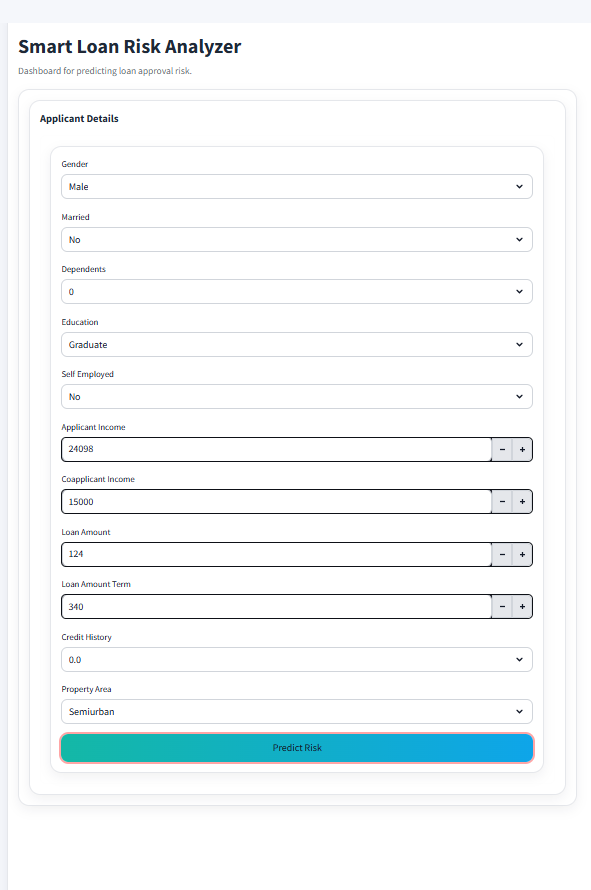
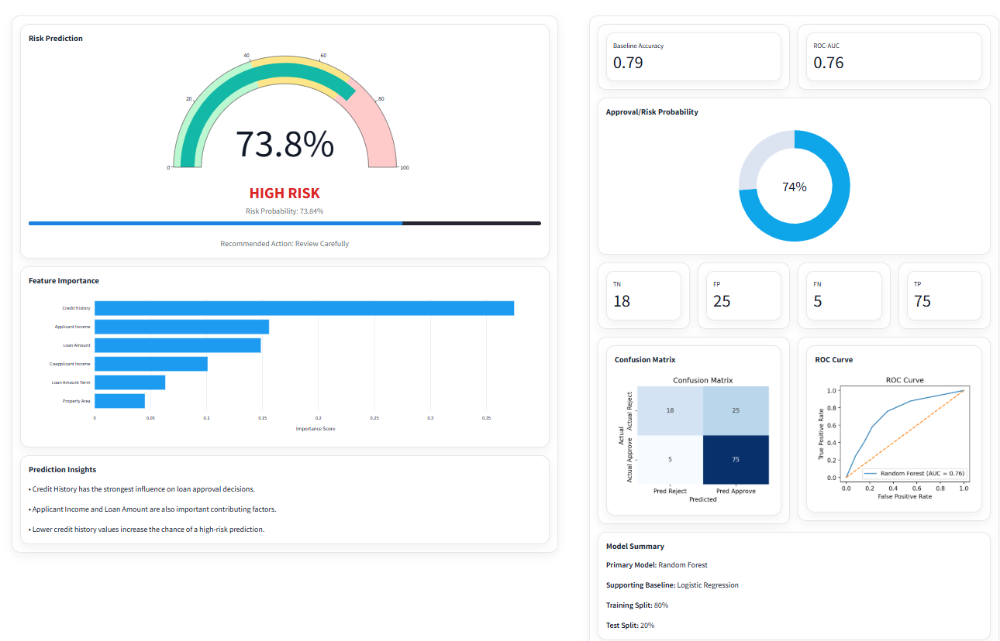

# Smart Loan Risk Analyzer

A Machine Learning web application that predicts loan approval risk using applicant financial and demographic information.  
The project includes a trained ML model and an interactive Streamlit dashboard where users can input applicant data and receive a prediction along with probability analysis and visual insights.

---

## Live Demo

https://smart-loan-risk-analyzer-zngw4cvieuds5yvzlhtjaq.streamlit.app/

---

## Project Overview

This project uses machine learning techniques to analyze loan application data and predict whether an applicant is likely to be approved or rejected for a loan.

The application is built with Streamlit to provide an interactive dashboard where users can input financial and demographic information and instantly receive a risk prediction.

The dashboard also includes visualizations such as probability gauges, feature importance charts, confusion matrix, and ROC curve to help understand the model's behavior.

---

## Features

- Loan approval risk prediction
- Interactive Streamlit dashboard
- Probability-based decision support
- Feature importance visualization
- Confusion matrix visualization
- ROC curve analysis
- Clean fintech-style user interface

---

## Tech Stack

Python  
Scikit-learn  
Streamlit  
Pandas  
NumPy  
Plotly  
Matplotlib  
Seaborn  
Joblib

---

## Machine Learning Model

Primary Model  
Random Forest Classifier

Supporting Baseline  
Logistic Regression

---

## Model Performance

Accuracy: 0.79  
ROC-AUC Score: 0.76

---

## Screenshots

### Dashboard

### Prediction Result

---

## Project Structure

---
Smart-Loan-Risk-Analyzer
│
├── app
│   └── streamlit_app.py
│
├── data
│   └── loan_data.csv
│
├── images
│   ├── dashboard.png
│   └── prediction.png
│
├── models
│   └── loan_model.pkl
│
├── notebooks
│   └── exploration.ipynb
│
├── src
│   ├── train_model.py
│
├── requirements.txt
├── runtime.txt
└── README.md

---

## Run Locally

Clone the repository

---
git clone
https://github.com/offbyone-dev/Smart-Loan-Risk-Analyzer.git
---

Go to the project directory

---
cd Smart-Loan-Risk-Analyzer
---

Install dependencies

---
pip install -r requirements.txt
---

Run the Streamlit app

---
streamlit run app/streamlit_app.py
---